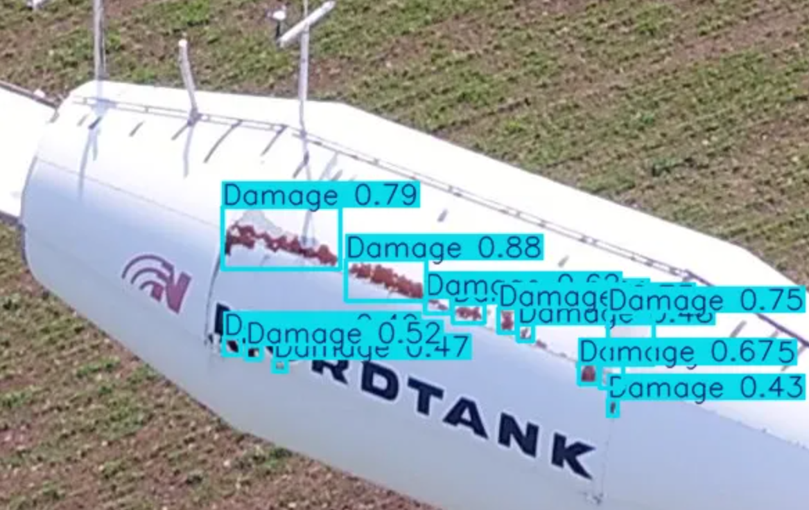

# **DeepWind: Detección de Defectos en Aerogeneradores con Deep Learning**

<div style="display: flex; justify-content: center; margin: auto; width: 100%;">
  <div style="display: flex;">
    
    
  </div>
</div>

## 🎯 **Descripción del Proyecto**
DeepWind es una solución basada en Deep Learning (YOLO) para la detección automática de defectos en aerogeneradores.

## 🛠️ **Requisitos**
```
kaggle
ultralytics
gradio
Pillow
opencv-python
```

## 📊 **Dataset**
El dataset se descarga automáticamente usando la API de Kaggle. Para configurarlo:

1. Asegúrate de tener credenciales de Kaggle `(~/.kaggle/kaggle.json)`
2. Ejecuta el script de descarga:
   ```
   python download_data.py
   ```
## 🚀 **Entrenamiento**
### **Opción 1: Entrenamiento Local**
Ejecuta el script de entrenamiento:
```
from train import train_model

results = train_model(
    data_yaml="yolo_dataset/data.yaml",
    epochs=50,
    batch_size=32,
    optimizer="AdamW"
)
```

### **Opción 2: Google Colab**
1. Abre `deepwind_colab_training.ipynb` en Google Colab. [](https://colab.research.google.com/github/ErikSarriegui/DeepWind/blob/main/deepwind_colab_training.ipynb)
2. Configura los hiperparámetros.
3. Ejecuta todas las celdas (e inicia sesión con Google en el caso de que tengas el dataset en el Google Drive)

## 💣 **Inferencia**
### **Opción 1: Inferencia en local**
1. Clona el proyecto (`git clone https://github.com/ErikSarriegui/DeepWind`) o descarga el modelo (`model/deepwind_model.pt`)
2. Utiliza la librería `ultralytics` para cargar el modelo y realizar inferencias:
```
from ultralytics import YOLO

model = YOLO("deepwind_model.pt")
resultados = model("path_a_tu_imagen")
```

### **Opción 2: Gradio en Google Colab**
1. Abre `deepwind_colab_inference.ipynb` en Google Colab. [](https://colab.research.google.com/github/ErikSarriegui/DeepWind/blob/main/deepwind_colab_inference.ipynb)
2. Ejecuta todas las celdas
3. Accede al link de Gradio

## 📈 **Rendimiento (Primera Iteración)**
A continuación se detalla el rendimiento de la primera iteración del modelo en términos de mAP (mean Average Precision) para dos métricas: mAP50 y mAP50-95. Este es un punto de partida, y se continuará trabajando en mejorar el modelo en futuras iteraciones.

## mAP50
- **Total (all)**: 0.823
- **Suciedad (Dirt)**: 0.953
- **Daño (Damage)**: 0.69

## mAP50-95
- **Total (all)**: 0.597
- **Suciedad (Dirt)**: 0.811
- **Daño (Damage)**: 0.382

**Nota:** Este es el resultado inicial del modelo, y se planean ajustes y mejoras en iteraciones posteriores para optimizar su rendimiento.
